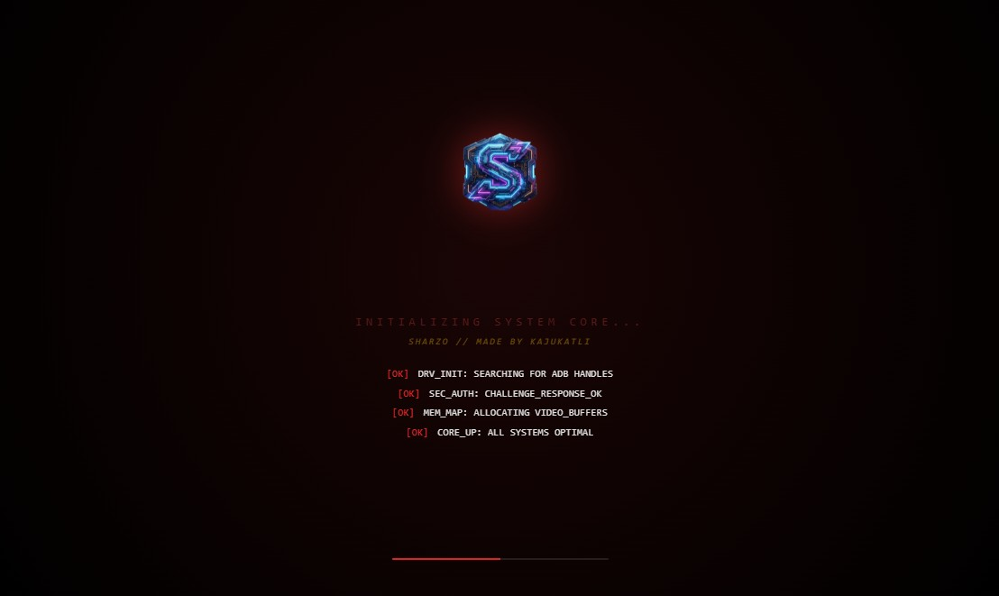
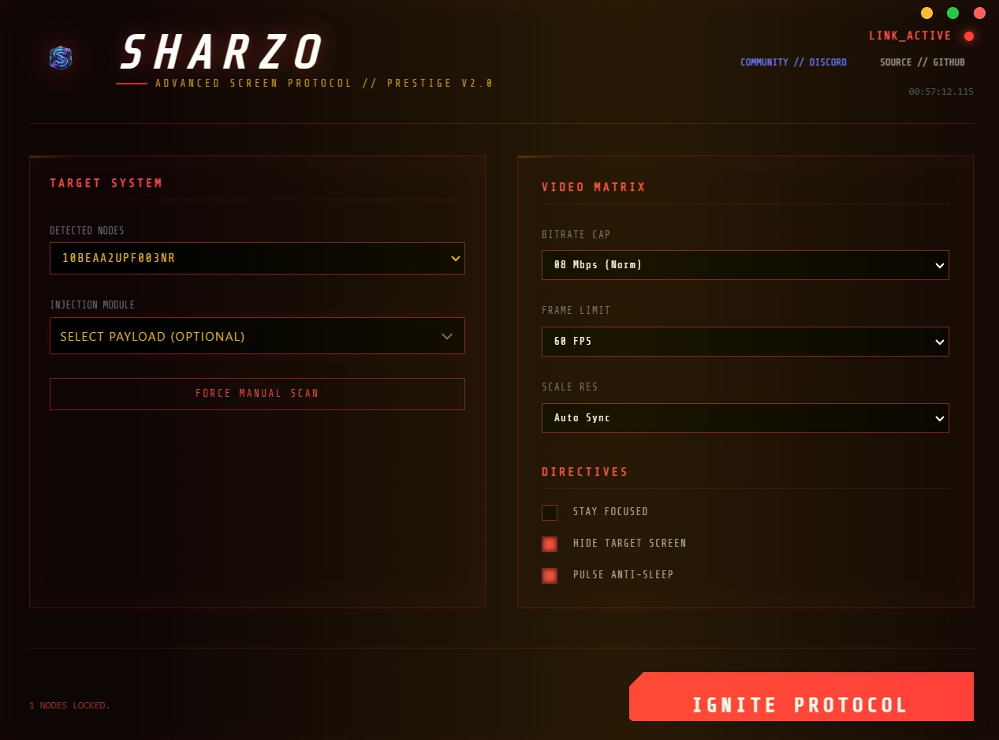

 
# 🛸 SHARZO
### Precision Control & Elite Mirroring for Android
**Developed by KAJUKATLIii**

> [!IMPORTANT]
> FOR PREMIUM  CONTACT ME AT DISCORD ITS FREE **`DISCORD`**  **`kajukatli`**.
> 
>  
---

## 🌟 OVERVIEW
**SHARZO** is a high-performance, terminal-inspired graphical interface designed for professional streamers, gamers, and power users. It provides seamless, ultra-low latency mirroring, recording, and full control over your Android device.

> [!IMPORTANT]
> You can launch the experience using either **`SHARZO HUD.exe`** or **`sharzo.exe`**.

---

## 🎯 PERFECT FOR

### 🎥 STREAMERS
*   **Live Broadcasts**: Stream mobile games to Twitch, YouTube, or other platforms.
*   **Reviews & Tutorials**: Show app tutorials and reviews with ease.
*   **Engagement**: Demonstrate mobile software crystal-clear to your audience.

### 🎮 GAMERS
*   **Big Screen Gaming**: Play mobile games on a much larger display.
*   **Elite Control**: Use keyboard and mouse for superior precision and speed.
*   **Highlight Reels**: Record your best gameplay highlights in high quality.

### 🎬 CONTENT CREATORS
*   **Educational**: Create professional-grade mobile app tutorials.
*   **Reviews**: Record and edit detailed product reviews.
*   **Social Media**: Produce high-quality vertical or horizontal mobile content.

### 🛠️ DEVELOPERS
*   **Real Testing**: Test your apps on real physical devices with PC visibility.
*   **Debugging**: Debug efficiently while recording screen sessions.
*   **Showcasing**: Present your latest app builds to clients professionally.

---

## 📋 REQUIREMENTS
*   **OS**: Windows PC (Windows 10/11 highly recommended).
*   **Device**: Android device with **USB Debugging** enabled.
*   **Connectivity**: High-speed USB cable or a stable Wi-Fi network.
*   **Drivers**: ADB drivers installed (pre-included in this pack).

---

## ⚡ QUICK START
1.  **Enable USB Debugging**: `Settings > Developer Options > USB Debugging`.
2.  **Connect**: Plug in your device via USB (or use Wi-Fi for wireless pairing).
3.  **Launch**: Run **`sharzo.exe`** (or `SHARZO HUD.exe`).
4.  **Engage**: Your device screen will instantly appear on your PC!

---

## 🛠️ DEVELOPER & SUPPORT
| Resource | Link |
| :--- | :--- |
| **Discord** | [Join Our Community](https://discord.gg/Vyq2hC6BuN) |
| **GitHub** | [Source Code](https://github.com/KAJUKATLIii/SHARZO) |
| **Developer** | KAJUKATLIii |

---

> [!TIP]
> **Join our Discord for exclusive themes, community builds, and instant support!**

---
*SHARZO - Precision. Control. Dominance.*
